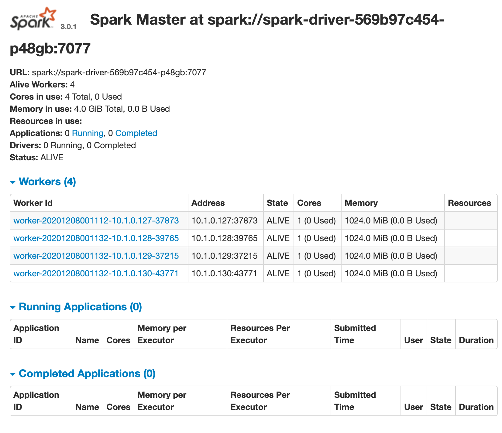

# hello-spark-k8s

Experiments to get spark running in a kubernetes context

## Quickstart

```bash
kubectl apply -f spark8s.yml

kubectl scale deployment.apps/spark-worker --replicas=4

kubectl port-forward service/spark-driver 8080:8080

# Open a browser with http://localhost:8080
# Ctrl-C on the terminal to exit the port forwarding

kubectl delete -f spark8s.yml
```


